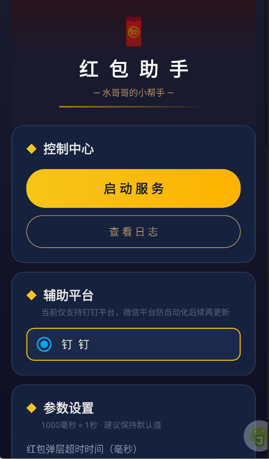
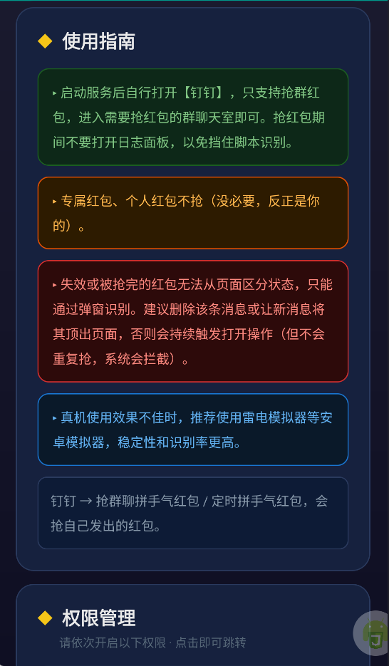

# DZMRedEnvelopeHelper

- 不可进行商业用途，仅供学习使用。

- 自用安卓版抢红包助手，非反编译而是使用 `autojs4.x` 自动化方式实现，支持钉钉、微信，抢不抢得到全看脸，但是起码不用手动。

- `注意`：`apk` 安装的方式，钉钉版本使用没问题，但是微信会存在找到按键缺点击失效的情况。遇到这种情况可以按下面的方式使用，效果一样。

- 可以直接使用安装包，或使用 [autojs4.x - apk](https://github.com/dengzemiao/DZMAutojsTools) 安装导入运行。

- 没有安卓机的，可以使用 [雷电 4.0 模拟器](https://github.com/dengzemiao/DZMAutojsTools/blob/main/ldplayerinst4_4.0.83.exe) 进行测试。

- [钉钉测试视频](./hb_dd.mp4)、[微信测试视频](./hb_wx.mp4)，自行下载观看测试效果，界面效果如下：

   。

- 分支信息：

  - `1.0.0` 分支使用的 `autojs pro 9.3.11`，感觉在有些机型上软件兼容还是有点问题，比如微信的抢红包按钮一直检测不出来或者延迟检测，其他内容可以检测。

  - `1.0.1` 分支使用的 `autojs 4.1.1`，感觉虽然老，但是兼容稳定没的说，后续优化也是基于这个版本。

    - 这个版本运行项目方式有点小问题，第一次直接运行可能会失败，而且代码必须是当前目录，比如 `src` 里面跑代码，遇到这种情况需要通过 `autojs 4.1.1` 指令重新创建项目，然后将代码拷贝过去，在重复之前的操作即可。
