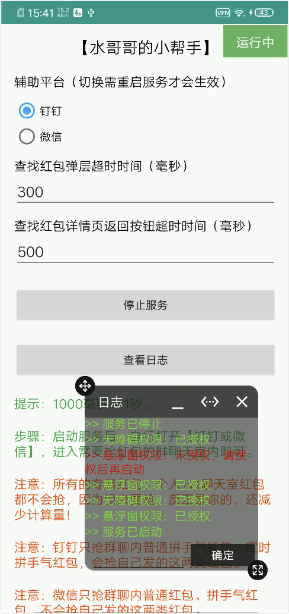

# DZMRedEnvelopeHelper

🧧 **钉钉红包助手** - 基于 AutoJS Pro 的自动化抢红包工具

## 📢 重要说明

> ⚠️ **当前版本（2.0.1）仅支持钉钉平台**，已移除微信支持。钉钉红包功能稳定可用。

> ⚠️ **仅供学习交流使用，不可用于商业用途。**

## ✨ 项目简介

安卓版钉钉抢红包助手，采用 `AutoJS Pro 9.3.11` 自动化方式实现，非反编译，代码开源透明。自动识别群聊红包并快速抢夺，解放双手，提升效率。

**核心特性：**
- ✅ 支持钉钉群聊拼手气红包
- ✅ 支持钉钉定时红包
- ✅ 自动识别并点击红包
- ✅ 智能返回聊天界面
- ✅ 界面美观，操作简单
- 🚀 **v2.0.2 新增**: 性能提升 6.6 倍，响应速度更快 ([查看优化详情](OPTIMIZATION.md) | [快速参考](QUICK_REFERENCE.md))

## 📦 使用方式

### 方式一：直接安装 APK
下载项目提供的 APK 安装包，直接安装使用。

**系统要求：**
- Android 7.0 及以上版本
- 支持 CPU 架构：`armeabi-v7a` 或 `arm64-v8a`

### 方式二：导入源码运行
1. 安装 `AutoJS Pro 9.x` 或更高版本
2. 导入 `main.js` 文件
3. 运行脚本即可使用

## 💻 使用模拟器

如果没有安卓设备，推荐使用以下模拟器（稳定性更好）：

- [雷电模拟器](https://www.ldmnq.com/)
- [MuMu模拟器](https://mumu.163.com/)
- [Genymotion 模拟器](https://www.genymotion.com/)

**模拟器要求：**
- Android 7.0 及以上版本
- CPU 类型为 `armeabi-v7a` 或 `arm64-v8a`

**相关资源：**
- [查看设备 CPU 类型的方法](https://blog.csdn.net/zz00008888/article/details/133696691)
- [钉钉 APK 下载（Google Play）](https://blog.csdn.net/zz00008888/article/details/122740312)
- [钉钉所有历史版本](https://www.wandoujia.com/apps/6565746/history)
- [钉钉 v6.3.10 版本直接下载](https://www.wandoujia.com/apps/6565746/history_v966)

> ⚠️ **重要提示：本工具仅支持钉钉 v6.3.10 版本**  
> - 如安装时提示 CPU 32位警告，无需担心，系统会自动兼容，可以正常安装和使用
> - 点击上方"钉钉 v6.3.10 版本直接下载"链接即可下载

## 📚 版本说明

| 版本 | 技术栈 | 特性说明 |
|------|--------|----------|
| **1.0.0** | AutoJS 4.1.1 | 初始版本，仅支持 `armeabi-v7a` 打包 |
| **1.0.1** | AutoJS Pro 9.3.11 | 支持双架构打包（`armeabi-v7a` + `arm64-v8a`） |
| **2.0.0** | AutoJS Pro 9.3.11（第1代API） | UI 全面升级，细节优化，bug 修复 |
| **2.0.1** | AutoJS Pro 9.3.11（第1代API） | 移除微信支持，专注钉钉平台，微信加了防自动化，后续换方案加回来。🚀 流程优化，性能提升 6.6 倍，响应速度更快 |

## 📸 效果展示

**演示视频：** [查看钉钉测试视频](https://github.com/dengzemiao/DZMRedEnvelopeHelper/blob/1.0.0/hb_dd.mp4)

**界面预览：**

<table>
  <tr>
    <td></td>
    <td></td>
  </tr>
</table>

## 🔧 使用指南

> ⚠️ **钉钉版本要求**  
> 本工具**仅支持钉钉 v6.3.10 版本**，请确保安装正确版本后使用。  
> - 钉钉 v6.3.10 版本下载：https://www.wandoujia.com/apps/6565746/history_v966  
> - 钉钉所有历史版本：https://www.wandoujia.com/apps/6565746/history  
> - CPU 32位警告可忽略，系统会自动兼容，可正常安装和抢红包。

**使用步骤：**
1. 安装钉钉 v6.3.10 版本（必须）
2. 启动应用，开启必要权限（无障碍服务、悬浮窗权限）
3. 点击"启动服务"按钮
4. 打开钉钉，进入需要抢红包的群聊
5. 等待红包出现，脚本会自动识别并抢夺
6. 使用期间不要打开日志面板，以免遮挡识别区域

**注意事项：**
- 失效红包建议删除或滑出屏幕，避免重复触发
- 会抢自己发出的红包

## 📝 免责声明

本项目仅供技术学习和交流使用，请勿用于任何商业用途。使用本工具产生的任何后果由使用者自行承担，与开发者无关。

## 👨‍💻 作者信息

- **GitHub：** [dengzemiao/DZMRedEnvelopeHelper](https://github.com/dengzemiao/DZMRedEnvelopeHelper)
- **博客主页：** [blog.csdn.net/zz00008888](https://blog.csdn.net/zz00008888)

---

⭐ 如果这个项目对你有帮助，欢迎 Star 支持一下！
